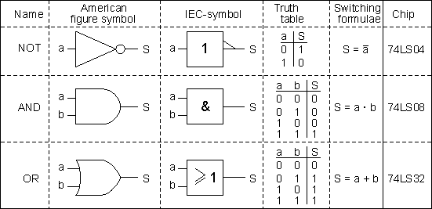
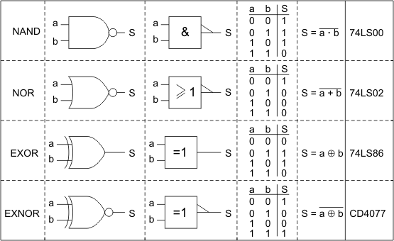
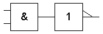
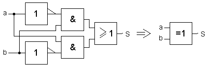

# Combinatorial circuits

A combinatorial circuit is a circuit that realises a specific <em>boolean</em> function.
This means that given a number of logical inputs, it produces a logical output.
When provided with the same inputs, it provides the same output.

## Truth tables
<to-do text="Say something about truth tables and how they can be used to define the behaviour of the combinatorial circuit"></to-do>

## Logic building blocks
There are three basic logic building blocks.
With these blocks, every possible truth table can be realised.
These blocks are the following:

{: .center}

With these blocks, the following commonly used building blocks can be derived:
{: .center}

For example, the NAND block is a combination of an AND and a NOT block:
{: .center}

Another example of how a derived block is composed of basic building blocks is the slightly more involved <em>exclusive or</em> (XOR) block:

{: .center}

## Related videos
<iframe width="560" height="315" src="https://www.youtube.com/embed/PqRf6GDuAls" frameborder="0" allow="accelerometer; autoplay; encrypted-media; gyroscope; picture-in-picture" allowfullscreen></iframe>
