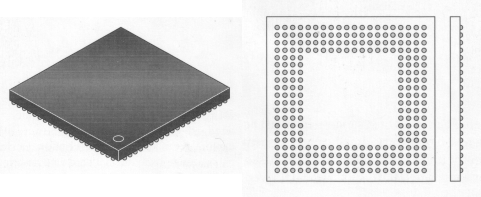
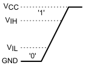

# Physical properties

## Packages
To mount an IC (Integrated Circuit) on a PCB (Printed Circuit Board), different technologies exist:
- [Through-hole technology](https://en.wikipedia.org/wiki/Through-hole_technology).

{: .center}

- [Surface-mount technology](https://en.wikipedia.org/wiki/Surface-mount_technology). These components are soldered directly onto the PCB.

{: .center}

- [Ball Grid Array (BGA)](https://en.wikipedia.org/wiki/Ball_grid_array). Connections are placed on the bottom of the chip. This is typically used for FPGAs (Field Programmable Gate Array) with many macrocells and microprocessors, due to their large amount of I/O connections.

{: .center}

## Classification
The complexity of a chip is often expressed in terms of the number of transisters it houses.
This varies between a few transistors, as in the SN7400, to more than a million in FPGAs.
The following classification is used:
- SSI Small Scale Integration, for standard ICs, such as AND gates and flip-flops.
- MSI Medium Scale Integration with 10 to 100 gates, such as counters and decoders.
- LSI Large Scale Integration, for ICs with 100 to 10,000 gates.
- VLSI Very Large Scale Integration, with 10,000 to 100,000 gates, for example microprocessors.
- ULSI Ultra Large Scale Integration, for ICs having more than 100,000 gates. Examples are Flash memory and CPUs such as the Pentium.

## Families
ICs can be made with transistors (a combination of NPN and PNP), and with FETs (Field-Effect Transistor).
The first generation of ICs was the TTL series (Transistor-Transistor Logic) of Texas Instruments, named the SN7400 series.
The power consumption was low, and the delay between input and output reasonably high.
Over time, the series has been enhanced with improved technologies:

| SN74xx    | Standard TTL
| SN74LSxx  | Low-power Schottky (has become the standard series)
| SN74Sxx   | Schottky (for fast applications, but consumes a lot of power)
| SN74ALSxx | Advanced Low-Power Schottky (used only little due to the emergence of CMOS)

All types operate at a supply voltage of 5 volts.

A transistor needs a base current in order to operate.
An FET operates with a gate potential.
The technology is CMOS (Complementary Metal Oxide Semiconductor).
CMOS consumes less power than TTL, causing the latter to go out of fashion.
The following series can be distinguished (differences are in propagation delay and power):

| CD4000 | CMOS standard 3V -- 18V
| HC     | High-speed CMOS 2V -- 6V
| HCT    | High-speed CMOS with TTL compatible inputs 5.0V
| LVC    | Low-voltage CMOS 3.3V
| AVC    | Advanced very low-voltage CMOS 2.5V
| AUC    | Advanced ultra low-voltage CMOS 1.8V

## Input Voltage and Current
For a logical high (i.e., a '1'), the input voltage must be higher than VIH (Voltage input-high).
For a logical low (a '0'), the input voltage must be lower than VIL (Voltage input-low).
Between these two levels, the input voltage may change without having an effect.
This is called [hysterisis](https://en.wikipedia.org/wiki/Hysteresis#Electronic_circuits).
<to-do text="Hysteresis refers to a system where the output lags behind the input, through a state (or something)"></to-do>

{: .center}

For VIH, the datasheet specifies a minimum value....
If the input *increases through* VIH, then the output of the chip changes to a logical high.
The table below also includes the input current.
In the CMOS, the input current at VIL is lower than the input current for 74LSxx standard series, by a factor of 4000.

| Family   | VIL | IIL | VIH | IIH | VCC
| SN74LSxx | 0.8V           | -0.4mA         | 2V             | 20&mu;A       | 5V
| CD4xxx   | 1.5V -- 4V     | -0.1&mu;A      | 3.5V -- 11V    | 0.1&mu;A      | 5V -- 15V
| 74HCxx   | 0.8V -- 2.8V   | -0.1&mu;A      | 1.2V -- 3.2V   | 0.1&mu;A      | 2V -- 6V

For the CMOS series, VIL and VIH depends on the supply voltage.
The input current, however, is independent of the supply voltage.

## Output Voltage and Current
<to-do text="What is this subsection trying to convey?"></to-do>
The output voltage depends on the supplied current, and is different for a logic '0' and '1'.
By definition, the current supplied to the chip is positive.
In the figure below left, the current flows in the opposite direction and therefore IOH is negative.

{: .center}

The manufacturer of a chip specifies the maximum output current.
For the 74LS and CMOS families, these are:

| Family   | IOH | VOH | IOL | VOL | VCC
| SN74LSxx | -0.4mA         | 3.4V 	    	 | 8mA  		  | 0.35V 		   | 5V
| CD4xxx   | -2.6mA 		| 9.95V 		 | 2.6mA  		  | 0.05V 		   | 10V
| 74HCxx   | -5.2mA 		| 5.81V 		 | 5.2mA 		  | 0.16V 		   | 6 V

#### Exercise 1
For the 74LSxx series, calculate the minimum value for the resistor RL for IOH.
Do the same for IOL.

## Fan-out
In an electronic circuit, the output of one chip may be connected to the input of multiple chips.
<to-do text="Add some more text here, explaining what the effect is of adding multiple chips. What happens to the current and voltage?"></to-do>

The so-called <em>fan-out</em> of a logic gate is the maximum number of inputs that can be connected to a single output.
For CMOS, the input current is negligible, and therefore a CMOS output can 'drive' many CMOS inputs.
Current is not the only factor that limits the number of input-output connections, however.
<em>Capacitance</em> also limits the fan-out, as the input capacitance determines the frequency behavior.
When connecting multiple inputs to one ouput, the total input capacitance increases and thus the maximum switching frequency decreases.

#### Exercise 2
{: .center}
For the SN74LSxx series, compute how many inputs can be connected to a single output.

## Rise times
Logical signals have two levels: logical high ('1') and logical low '0'.
In reality, though, it is physically impossible for a signal to rise from low to high <em>instantaneously</em>.
A signal has a <em>rise time</em>, typically denoted by tr.
This is the time taken by the signal to change from a specified low value to a specified high value.
Likewise, a signal also has a <em>fall time</em>, denoted by tf.
The rise and fall time have an impact on the maximum switching frequency:
a longer rise (or fall) time means that it takes more time to switch from a logical low to a logical high (or the other way around), and thus the maximum rate at which these switches can be made is smaller.
A reasonable function generator has a tr and tf that are both smaller than 6ns.

For the output of a chip, instead of rise and fall time, the respective terms <em>output transition time low-high</em> (tTLH) and <em>output transition time high-low</em> (tTHL) are commonly used.
{: .center}

#### Exercise 3
For the 74HCT series, the output transition times tTLH and tTHL are 15ns (at an ambient temperature of 25&deg;C).
What is the maximum switching frequency?

## Propagation delay
The propagation time is the delay before the output signal changes after a change of the input signal.
The times tPLH (time Pulse-Low-High) and tPHL (time Pulse-High-Low) are usually specified at 50% of VCC.
For the 74HCT specifies a maximum value for this time of 19ns (at Tamb = 25&deg;C). With a Tamb = 125&deg;C, tPLH and tPHL increase to 29 ns.

In the following circuit, the inverter has a propagation delay tP.
For convenience, the propagation time of the XOR is zero.
The output signal exhibits spikes.
This is also called glitches (interference impulses).
Spikes are the most vicious faults in a circuit.

{: .center}

#### Exercise 4
Given the circuit drawn below, draw an input signal for A, consisting of one period of a square wave with a frequency of 10MHz and a duty cycle of 50% in Figure...
Then draw the resulting signals A' and X.
<to-do text="Add figure refs, and fix the figure with the grid"></to-do>
{: .center}
{: .center}

## Schmitt-trigger
Rather than going straight from a logical low to a logical high, a signal may fluctuate.
Take for example the cruise control of a car, which tries to hold the car at a constant speed.
The car's speed sensor delivers a signal that fluctuates due to many factors, such as gusts, bumps, ramps, etc.
Suppose an IC has a turning point (VM) at half of the supply voltage, then the following situation arises.
<to-do text="Ensure that the term turning point has been explained earlier, or else elaborate a bit more here, possibly avoiding the whole term turning point"></to-do>

{: .center}

If the board computer would respond to any fluctuation of the speed sensor by accelerating or decelerating,
then the resulting supply of gasoline would quickly lead to premature damage of the engine.
This is clearly undesired.
Rather than respond to tiny fluctuations, the board computer should only respond to steady changes.
One way of doing this, is to introduce a <em>hysteresis</em>.
This means that, after the signal has increased above a certain threshold, the signal must decrease below a lower threshold in order to be regarded as a change in value.

Digital circuits also have hysteresis.
The datasheet of an IC specifies at which voltage levels the logical signal chanegs from low ('0') to high ('1'), or vice versa.
If the voltage level increases above VIH, then the output signal stays logically high until the voltage level drops below VIL.

{: .center}

This relation between input and output voltage is described by the following figure:
{: .center}

ICs naturally have a hysteresis, the exact switching levels however depend on temperature, load and voltage.
Therefore, special ICs called <em>Schmitt triggers</em> are designed, with well-defined hysteresis voltages.
Examples are the 74LS13/14 and CA3098.
The technical symbol of the Schmitt trigger resembles the input-output voltage relation shown in Figure ?.

