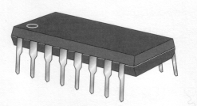
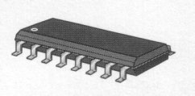
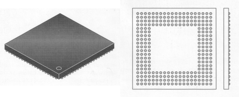
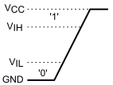

# Chapter 8 - Physical properties

## Packages
To mount an IC (Integrated Circuit) on a PCB (Printed Circuit Board), different technologies exist:
- [Through-hole technology](https://en.wikipedia.org/wiki/Through-hole_technology).

- [Surface-mount technology](https://en.wikipedia.org/wiki/Surface-mount_technology). These components are soldered directly onto the PCB.

- [Ball Grid Array (BGA)](https://en.wikipedia.org/wiki/Ball_grid_array). Connections are placed on the bottom of the chip. This is typically used for FPGAs (Field Programmable Gate Array) with many macrocells and microprocessors, due to their large amount of I/O connections.

## Classification
The complexity of a chip is often expressed in terms of the number of transisters it houses.
This varies between a few transistors, as in the SN7400, to more than a million in FPGAs.
The following classification is used:
- SSI Small Scale Integration, for standard ICs, such as AND gates and flip-flops.
- MSI Medium Scale Integration with 10 to 100 gates, such as counters and decoders.
- LSI Large Scale Integration, for ICs with 100 to 10,000 gates.
- VLSI Very Large Scale Integration, with 10,000 to 100,000 gates, for example microprocessors.
- ULSI Ultra Large Scale Integration, for ICs having more than 100,000 gates. Examples are Flash memory and CPUs such as the Pentium.

## Families
ICs can be made with transistors (a combination of NPN and PNP), and with FETs (Field-Effect Transistor).
The first generation of ICs was the TTL series (Transistor-Transistor Logic) of Texas Instruments, named the SN7400 series.
The power consumption was low, and the delay between input and output reasonably high.
Over time, the series has been enhanced with improved technologies:

| SN74xx    | Standard TTL
| SN74LSxx  | Low-power Schottky (has become the standard series)
| SN74Sxx   | Schottky (for fast applications, but consumes a lot of power)
| SN74ALSxx | Advanced Low-Power Schottky (used only little due to the emergence of CMOS)

All types operate at a supply voltage of 5 volts.

A transistor needs a base current in order to operate.
An FET operates with a gate potential.
The technology is CMOS (Complementary Metal Oxide Semiconductor).
CMOS consumes less power than TTL, causing the latter to go out of fashion.
The following series can be distinguished (differences are in propagation delay and power):

| CD4000 | CMOS standard 3V -- 18V
| HC     | High-speed CMOS 2V -- 6V
| HCT    | High-speed CMOS with TTL compatible inputs 5.0V
| LVC    | Low-voltage CMOS 3.3V
| AVC    | Advanced very low-voltage CMOS 2.5V
| AUC    | Advanced ultra low-voltage CMOS 1.8V

## Input Voltage and Current
For a logical high (i.e., a '1'), the input voltage must be higher than VIH (Voltage input-high).
For a logical low (a '0'), the input voltage must be lower than VIL (Voltage input-low).
Between these two levels, the input voltage may change without having an effect.
This is called [hysterisis](https://en.wikipedia.org/wiki/Hysteresis#Electronic_circuits).
<to-do>Hysteresis refers to a system where the output lags behind the input, through a state (or something)</to-do>

{: .center}

For VIH, the datasheet specifies a minimum value....
If the input *increases through* VIH, then the output of the chip changes to a logical high.
The table below also includes the input current.
In the CMOS, the input current at VIL is lower than the input current for 74LSxx standard series, by a factor of 4000.

| Family   | VIL | IIL | VIH | IIH | VCC
| SN74LSxx | 0.8V           | -0.4mA         | 2V             | 20&mu;A       | 5V
| CD4xxx   | 1.5V -- 4V     | -0.1&mu;A      | 3.5V -- 11V    | 0.1&mu;A      | 5V -- 15V
| 74HCxx   | 0.8V -- 2.8V   | -0.1&mu;A      | 1.2V -- 3.2V   | 0.1&mu;A      | 2V -- 6V

## Propagation delay
The propagation time is the delay before the output signal changes after a change of the input signal.
The times tPLH (time Pulse-Low-High) and tPHL (time Pulse-High-Low) are usually specified at 50% of VCC.
For the 74HCT specifies a maximum value for this time of 19ns (at Tamb = 25&deg;C). With a Tamb = 125&deg;C, tPLH and tPHL increase to 29 ns.

In the following circuit, the inverter has a propagation delay tP. For convenience, the propagation time of the XOR is zero. The output signal exhibits spikes. This is also called glitches (interference impulses). Spikes are the most vicious faults in a circuit.

